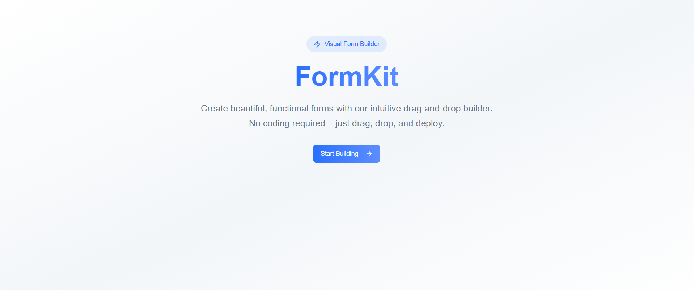
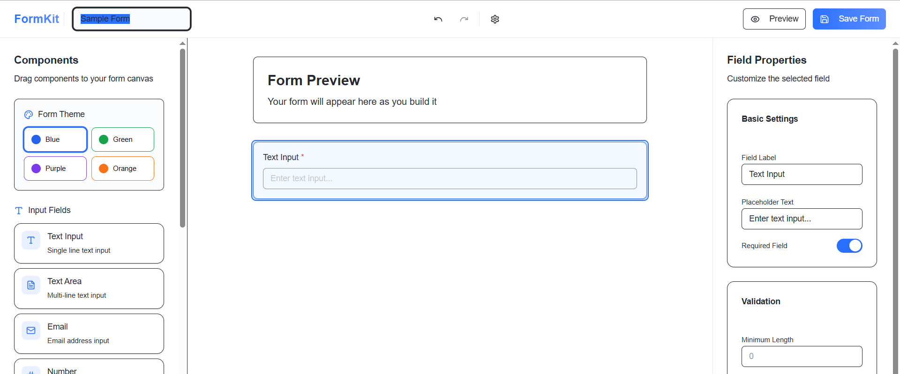
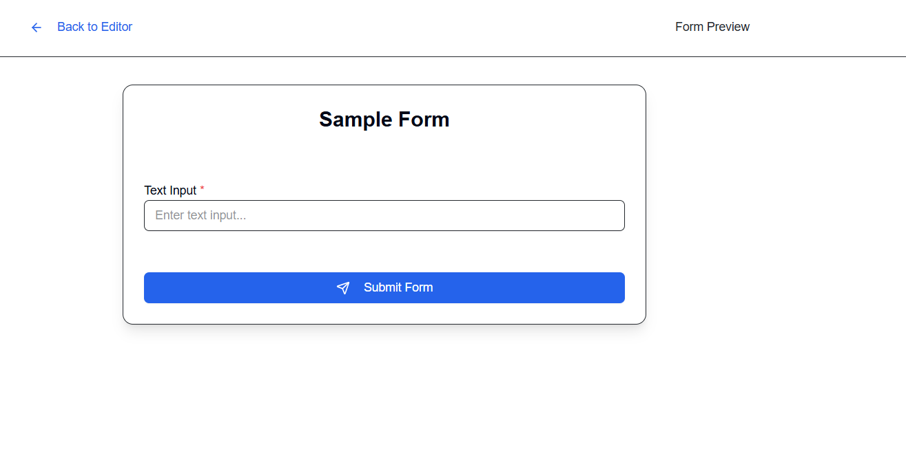

# FormKit - Drag & Drop Form Builder

A powerful, intuitive drag-and-drop form builder built with React, TypeScript, and modern web technologies. Create beautiful, responsive forms with real-time preview and customization options.

## Features

### Core Functionality

- **Drag & Drop Interface**: Intuitive form building with drag-and-drop components
- **Real-time Preview**: See your form as you build it with live preview mode
- **Undo/Redo**: Full history management with visual feedback
- **Field Management**: Add, edit, reorder, and delete form fields
- **Form Customization**: Custom colors, themes, and styling options

### Supported Field Types

- **Text Input**: Single-line text fields with validation
- **Textarea**: Multi-line text input
- **Email**: Email input with built-in validation
- **Number**: Numeric input fields
- **Select Dropdown**: Single and multi-select options
- **Radio Buttons**: Single choice selection
- **Checkboxes**: Multiple choice selection
- **Logo Upload**: Brand logo integration
- **Cover Image**: Header image support

### Advanced Features

- **Form Theming**: Customize colors, backgrounds, and text styles
- **Field Validation**: Required fields, pattern matching, length constraints
- **Responsive Design**: Mobile-first, works on all devices
- **Settings Management**: Form-level and field-level configuration
- **Export Options**: Save and share your forms

## Technology Stack

- **Frontend Framework**: React 18 with TypeScript
- **Build Tool**: Vite for fast development and building
- **Styling**: Tailwind CSS with custom design system
- **UI Components**: Shadcn/ui component library
- **State Management**: Zustand for global state
- **Drag & Drop**: @dnd-kit for smooth interactions
- **Icons**: Lucide React
- **Routing**: React Router Dom

## Installation

1. **Clone the repository**

```
git clone https://github.com/sanju1098/okta-design-assignments
cd okta-design-assignment2
```

2. **Install dependencies**

```
npm install
```

3. **Start development server**

```
npm run dev
```

4. **Build for production**

```
npm run build
```

## Quick Start

1. **Access the Builder**: Navigate to `/builder` to start creating forms
2. **Add Fields**: Drag components from the sidebar to the canvas
3. **Customize**: Select fields to edit properties in the property panel
4. **Preview**: Click "Preview" to see your form in action
5. **Settings**: Use the settings icon to configure form details

## Project Structure

```
src/
├── components/
│   ├── form/
│   ├── component-item.tsx      # Draggable component items
│   ├── form-builder-sidebar.tsx # Component library sidebar
│   ├── form-builder-header.tsx # Top navigation and actions
│   ├── form-builder-canvas.tsx # Main drop area and form display
│   ├── sortable-form-field.tsx # Individual form field components
│   ├── form-preview.tsx        # Preview mode display
│   └── property-panel.tsx      # Field configuration panel
├── lib/
│   ├── store.ts               # Zustand state management
│   └── utils.ts               # Utility functions
├── pages/
│   ├── Builder.tsx            # Main form builder page
│   ├── Index.tsx              # Landing page
│   └── NotFound.tsx           # 404 error page
└── styles/
    └── index.css              # Global styles and design tokens
```

## Component Architecture

### Core Components

#### `FormBuilderSidebar`

- **Purpose**: Component library and toolbox
- **Features**: Draggable field types, color customization, form settings
- **Usage**: Provides all available form components for drag-and-drop

#### `FormBuilderCanvas`

- **Purpose**: Main workspace where forms are built
- **Features**: Drop target, field reordering, empty state
- **Usage**: Central area for form construction and organization

#### `FormBuilderHeader`

- **Purpose**: Navigation and global actions
- **Features**: Form title editing, undo/redo, preview toggle, settings
- **Usage**: Main toolbar with form-level controls

#### `SortableFormField`

- **Purpose**: Individual form field representation
- **Features**: Drag handles, field-specific rendering, controls
- **Usage**: Displays and manages individual form components

#### `FormPreview`

- **Purpose**: Real-time form preview
- **Features**: Live form rendering, theme application, submission simulation
- **Usage**: Shows how the final form will look and behave

#### `PropertyPanel`

- **Purpose**: Field configuration interface
- **Features**: Field properties, validation rules, options management
- **Usage**: Allows detailed customization of selected fields

#### `ComponentItem`

- **Purpose**: Draggable component in sidebar
- **Features**: Drag initiation, component metadata, visual representation
- **Usage**: Enables drag-and-drop of new components to canvas

## Design System

The application uses a comprehensive design system with:

- **Semantic Color Tokens**: Consistent theming across components
- **HSL Color System**: Future-proof color management
- **Responsive Breakpoints**: Mobile-first design approach
- **Animation System**: Smooth transitions and micro-interactions
- **Typography Scale**: Consistent text sizing and hierarchy

## State Management

The application uses Zustand for state management with the following key features:

- **Form Fields**: Array of field configurations
- **Selection State**: Currently selected field for editing
- **Preview Mode**: Toggle between build and preview modes
- **History Management**: Undo/redo functionality
- **Theme Settings**: Form appearance customization

## Routing

- `/` - Landing page
- `/builder` - Form builder interface
- `*` - 404 error page for invalid routes

## Field Configuration

Each form field supports:

- **Basic Properties**: Label, placeholder, required status
- **Validation Rules**: Pattern matching, length constraints
- **Type-specific Options**: Dropdown options, radio choices
- **Upload Settings**: File type restrictions, size limits
- **Styling Options**: Custom appearance settings

## Development Tips

1. **Adding New Field Types**: Extend the `FormField` interface and update rendering logic
2. **Custom Themes**: Modify design tokens in `index.css`
3. **State Updates**: Use the store actions for consistent state management
4. **Component Extensions**: Follow the existing patterns for new components




